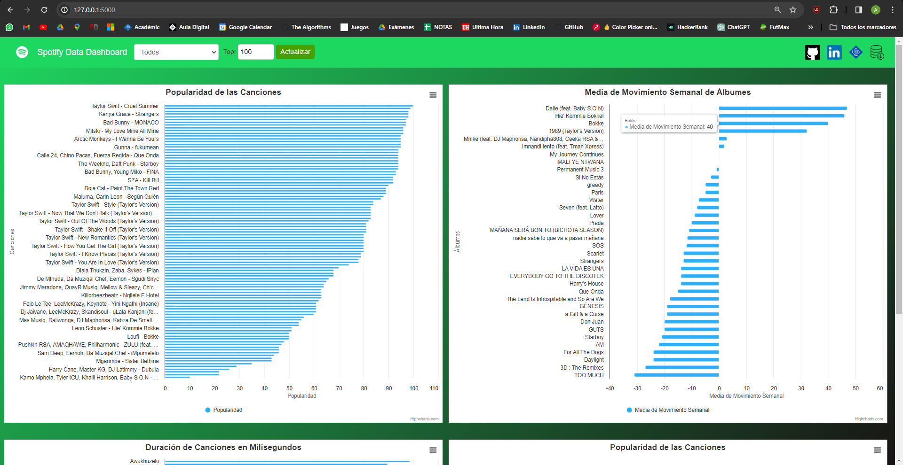

# Dashboard

## Instalación
Para iniciar el servidor y la aplicación web, necesitaremos instalar algunas bibliotecas de Python si no las tenemos ya en nuestra máquina.
Asegurarse de tener Python instalado en el sistema. Después, podemos instalar las librerías necesarias con el comando:

`pip install Flask pandas`

Este comando instalará las bibliotecas `Flask` y `pandas`. 

## Dataset
Nuestra web carga datos desde un archivo CSV (`universal_top_spotify_songs.csv`).
El conjunto de datos presenta las canciones más populares en tendencia en más de 70 países. 
Este archivo debe encontrarse en el mismo directorio que nuestro servidor de Python.

## Endpoints
El programa Python que utiliza el framework Flask para crear un servidor web, también contiene rutas (endpoints) para acceder a ciertos datos del conjunto de datos de Spotify.

## Ejecución del servidor
Después de instalar las bibliotecas y comprobar que tenemos el dataset en el directorio correspondiente, podemos ejecutar nuestra aplicación.

El comando para iniciar la aplicación es:
`python app.py`

Esto iniciará el servidor Flask, y mostrará en la terminal una URL para acceder a la aplicación web:
 `http://127.0.0.1:5000/`

 ## Ejemplo
 Cuando se ejecute el servidor y se acceda a la URL indicada en la terminal, deberá aparecer una pantalla como esta:

 